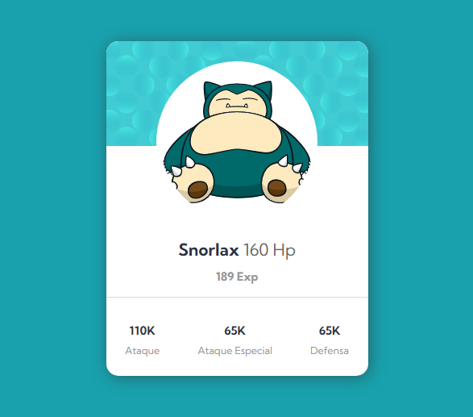

# CardPokeAPI
### The challenge

Users should be able to:

- View the optimal layout for the app depending on their device's screen size
- See hover states for all interactive elements on the page
- Use the slider and toggle to see prices for different page view numbers

### Screenshot

### Links

- Live Site URL: [Link](https://fabioalcocer.github.io/cardPokeAPI/)

## My process

### Built with

- Semantic HTML5 markup
- CSS custom properties
- Flexbox
- Mobile-first workflow
- Javascript Vanilla
- Fetch
- Async/Await

### What I learned

Project in vanilla JS in which I practiced extracting information from a public API. Putting into practice concepts such as fetch, async, await.

## Author

- LinkedIn - [Fabio Alcocer](https://www.linkedin.com/in/fabio-alcocer/)
